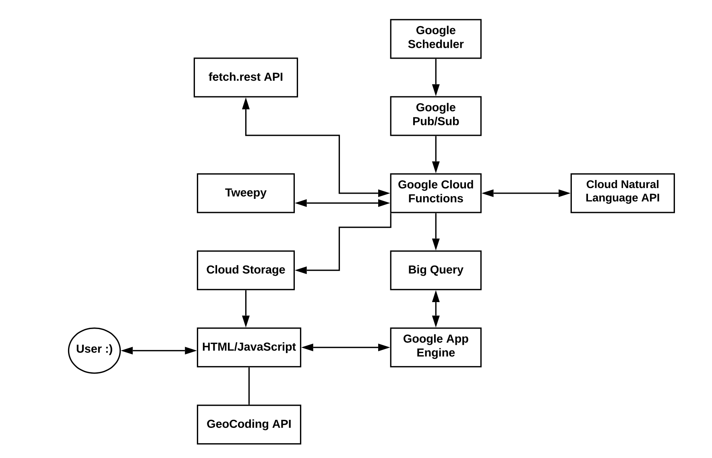
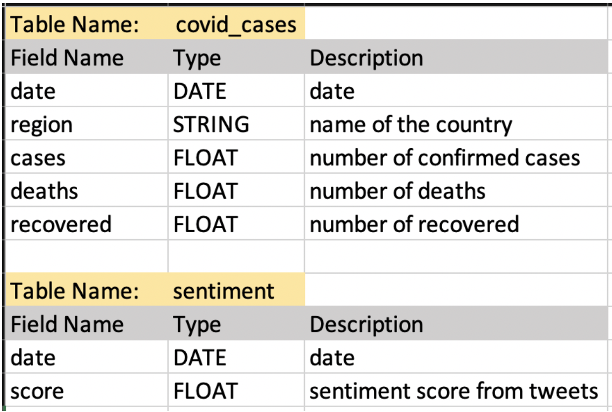
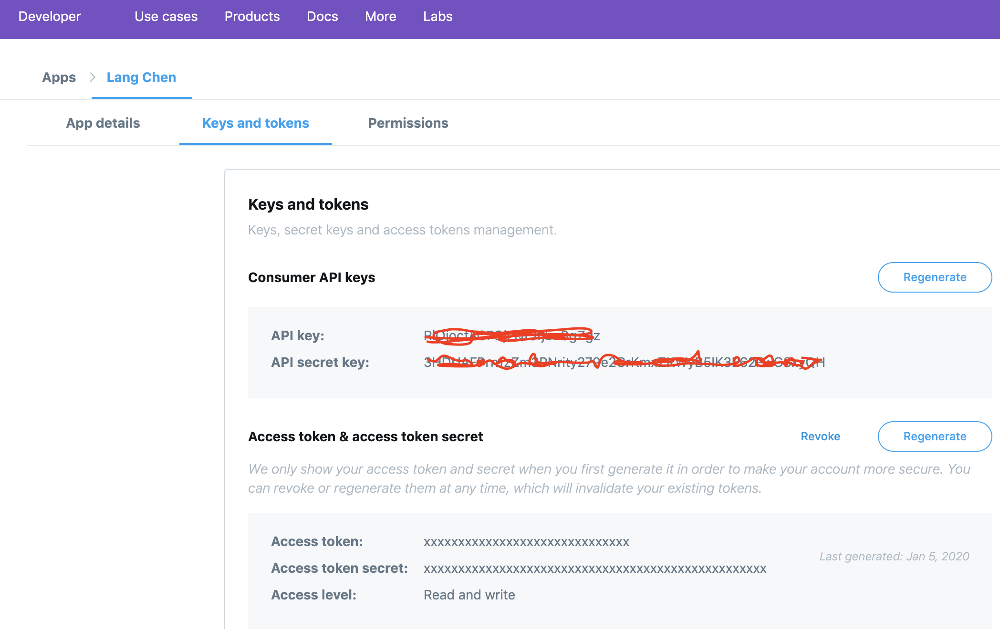
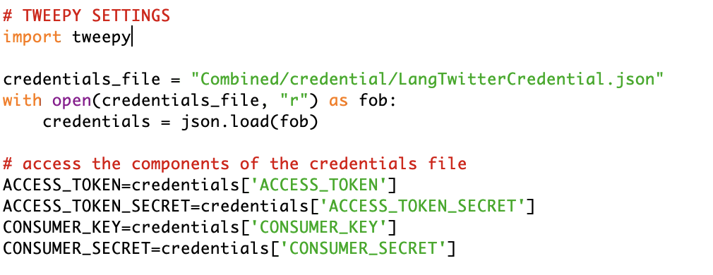
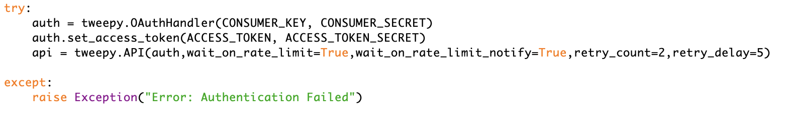
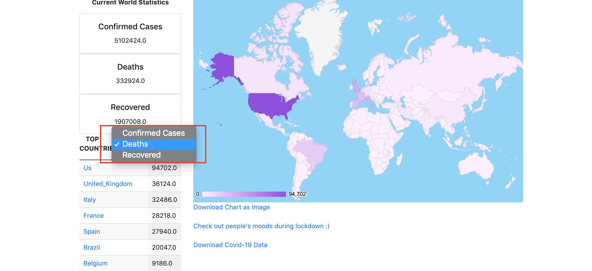
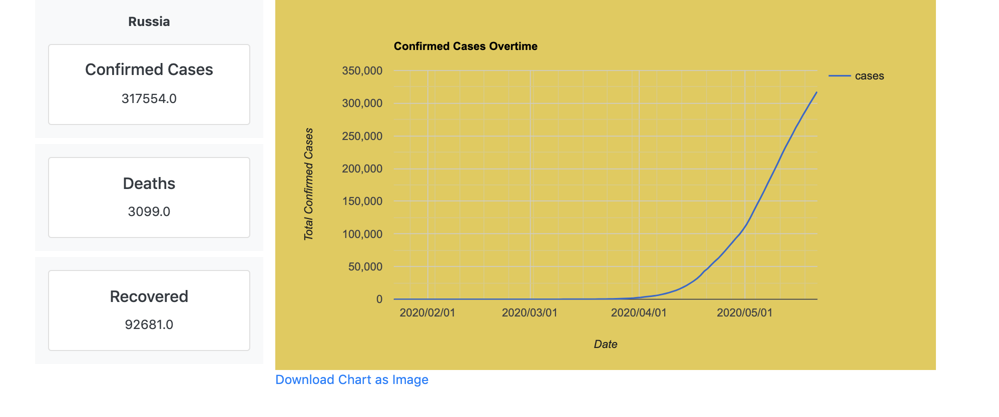
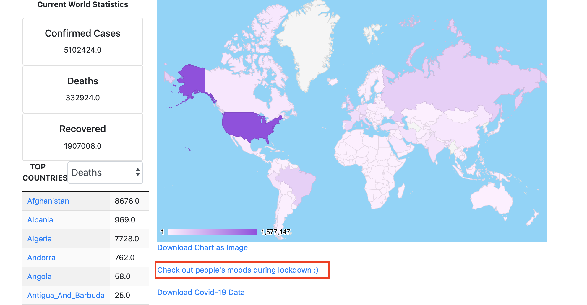
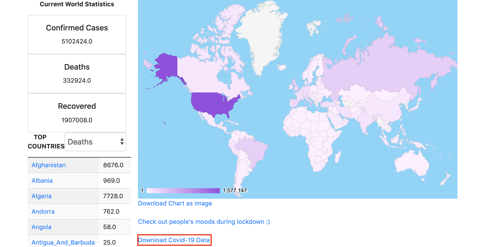

# Summary 
This project aims at providing real-time Covid-19 information from all around the world to users. The information includes number of confirmed cases, number of deaths, number of recovered, the trend of growth of confirmed cases in each country as well as how people’s mood fluctuates during the lockdown. At the same time, it also provides the raw historic worldwide data of Covid19 to developers for their own purpose.

# Introduction
As Covid-19, a world pandemic, has been progressing, it’s important to provide users with a quick visualized overview of the latest data in a user-friendly way. Even though there are already websites providing the latest worldwide statistical data, they tend to ignore the data of how people’s emotion fluctuates during this challenging time when the whole world is under lockdown. Meanwhile, it’s equally important to provide an easy access to developers who want to make use of the latest Covid-19 data in their own projects or researches. As a result, Covid-19 Info is a 3-in-1 application which visualises both the worldwide statistical data and the worldwide sentiment data for regular users and provides an easy access to the historic data for developers.

# Related-work
[1]Our World in Data updates the data by on Covid19 by country on a daily basis. https://ourworldindata.org/coronavirus-country-by-country

[2]Global Map in Johns Hopkins Coronavirus resource center displays the latest global Covid-19 trends. https://coronavirus.jhu.edu/map.html

# Software Design/Architecture

## APIs & Cloud Services used

### Google App Engine
Covid-19 Info is hosted on Google App Engine, which is a serverless platform for hosting web applications.

### Google Big Query
In order to visualise the latest worldwide data, Big Query is required for the relational data storage and query.
Tables in my dataset: Covid_cases, sentiment.

### Fetch.rest.API
The Covid-19 statistical data is retrieved from fetch. rest API, which provides data retrieved from John Hopkins Coronavirus resource center. (https://fetch.rest/)

### Twitter API
It’s used to retrieve tweets with hashtag ‘#Covid19’ for sentiment analysis, which gives us a glimpse of how people feel during lockdown.

### Cloud Storage
Non-relational database storage. In this case, it’s used to store the latest Covid-19 statistical data. The bucket storing the data has public access, so anyone can download the data just by clicking the link. It’s also used to store the tweets data used in sentiment analysis as backup, as in Tweepy we can only crawl the tweets within the last 7 days.

### Cloud Natural Language API
It’s used for conducting sentiment analysis on the ‘#Covid19’ tweets, then the results is used to visualise people’s emotions during lockdown.

### Geocoding API
A tool to convert country names into geocoding, with which markers on the map are placed. In Covid-19 Info, during visualising the latest numbers of confirmed case, deaths and recovered worldwide, country names from the dataset needs to be converted to geocoding before the integration between the world Google geochart and the dataset.

### Google Pub Sub
Pub/Sub allows the communication among different applications within the project. In Covid-19 Info, Pub/Sub is used to communicate between the Cloud Scheduler and Cloud Function, so that every day the latest covid-19 data and sentiment data is updated by triggering Cloud Function.

### Google Scheduler
It allows triggering an event with a specified frequency. In Covid-19 Info, a function which updates the covid-19 data is triggered at 4:00 A.M UTC every day, and another function that updates the sentiment data is triggered at 12:30 A.M UTC daily.

### Google Cloud Functions
A serverless execution environment. In Covid-19 Info, it’s used to fetch the tweets daily, conduct sentiment analysis with the tweets retrieved, then store the tweets in Big Query for sentiment data visualisation and in Cloud Storage for backup. At the same time, it also updates the Covid-19 data daily, store it in Big Query for visualisation and Cloud Storage for download.

# Implementation
## Set up
### [Set up the development environment for Python 3 in App Engine](https://cloud.google.com/appengine/docs/standard/python3/quickstart)

### Install Modules
1. [Install Flask](https://flask.palletsprojects.com/en/1.1.x/installation/)
2. [Install Jinja2](https://jinja.palletsprojects.com/en/2.11.x/intro/)
3. [Install httplib2](https://pypi.org/project/httplib2/)
4. [Install tweepy](http://docs.tweepy.org/en/latest/install.html)

### Install Google Cloud libraries
1. List of libraries to install: [google, google-auth, google-cloud-bigquery, google-cloud-bigquery]
2. Command Line: pip install [name of library]

## Front End
### Build and Deploy Front End
1. Please refer to “main.py” , “templates” in the source file for specific steps. 2. In general, for the front end development, JQuery is used for user
interaction, Bootstrap is used for responsive design, DataTables is used for displaying tables, GoogleChart is used for visualising the covid19 and the sentiment analysis data.
3. The source code needs to run in a virtual machine. To activate virtual machine: python3 -m venv env source env/bin/activate
4. a. Run it locally : python main.py
b. Deploy it on cloud: gcloud app deploy —project [projectID]
5. For better understanding the code of the front end development, please refer to tutorials of flask, jinja2, bootstrap and javascript

* [Flask Tutorial](https://www.tutorialspoint.com/flask/index.htm) 
* [Jinja2 Tutorial](https://jinja.palletsprojects.com/en/2.11.x/)     
* [Bootstrap Tutorial](https://getbootstrap.com/docs/4.4/getting-started/introduction/) 
* [Javascript Tutorial](https://www.w3schools.com/js/)

## Back End
### Big Query 
1. [Set up](https://cloud.google.com/bigquery/docs/bigquery-web-ui)
2. Create a dataset and a table, please refer to Week 3 Lab BigQuery section
3. After you get familiar with Big Query from the web console, it’s time to move on to intreating with Big Query through the client libraries from your source code.
- * [Run an query](https://cloud.google.com/bigquery/docs/running-queries#queries)

### Cloud Storage
1. Create a bucket from web console is pretty straightforward, please go to the Cloud Storage Console.
2. [Interacting with bucket through the client library](https://googleapis.dev/python/storage/latest/client.html)

### Tweepy
#### Setup: 
- Retrieve the credential from the developer dashboard.

- Store the credential information in a json file

- Connect to tweepy api

#### [Tweepy tutorial] (http://docs.tweepy.org/en/v3.5.0/getting_started.html)

#### Tweepy implementation
More details about the tweepy implementation of this project, please refer to “google_functions/update_sentiment/main.py” in the source file.

### Natural Language API / Analysing Sentiment
- [Tutorial on analysing sentiment from Google Cloud Storage](https://cloud.google.com/natural-language/docs/analyzing-sentiment#analyzing_sentiment_from_google_cloud_storage)

- Details code of this project: "google_functions/update_covid_data/ update_covid_data.py" in the source file.

### Google Scheduler
1. [Tutorial](https://cloud.google.com/scheduler/docs/quickstart#create_a_job)
2. [Cron job syntax used in Frequency](https://crontab.guru/)

### Google PubSub 
1. [Tutorial using console](https://cloud.google.com/pubsub/docs/quickstart-console)

### Google Function
1. [Tutorial using console](https://cloud.google.com/functions/docs/quickstart-python)

# User Manual 
### [Website Link](https://covid19-274903.wl.r.appspot.com)
There are mainly 3 things you can do in Covid-19 Info.
* Check the numbers of confirmed cases, deaths and recovered globally.
* Check the trend of confirmed cases of the country you pick.
* Check the emotion fluctuation of people all around the world during lock down.

1. [Click this link](https://covid19-274903.wl.r.appspot.com)
2. Select Cases/Deaths/Recovered

3. Select the country you want to view from “TOP COUNTRIES” or the world map.

4. After clicking the country, you are brought to the country page, you can also download the Chart.

5. For sentiment visualisation, please go back to the main page first, then click the link.

6. You can also download the raw data of Covid-19

